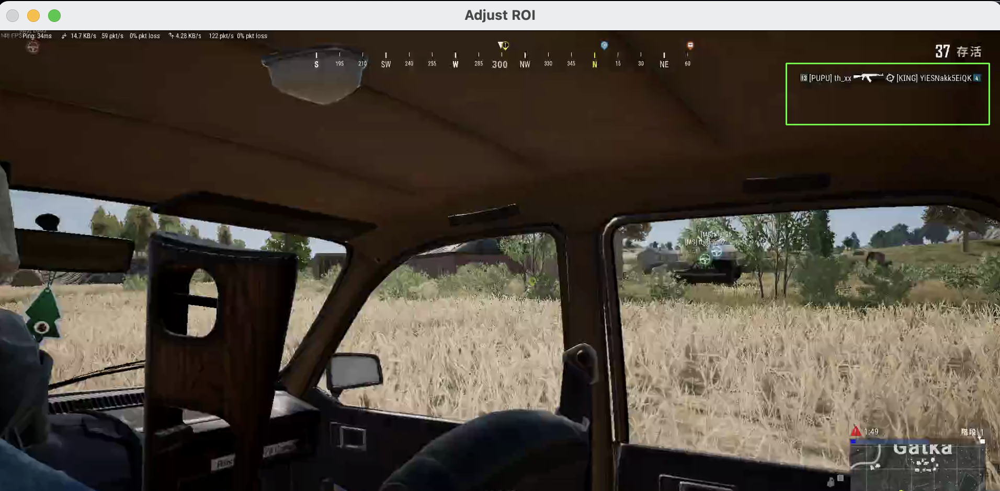

# python-learning

全程用 cline 编写的 PUBG 视频击杀信息定位工具，当然，也可以用于其他视频

## Usage

```shell
python main.py --player_id="abc" --input xxx.mp4 --output output.csv --show_progress --frame_interval=100
```

- frame_interval: 多久处理 1 帧 (毫秒)，默认 100
- show_progress: 是否展示处理过程

运行后鼠标拖选处理范围


